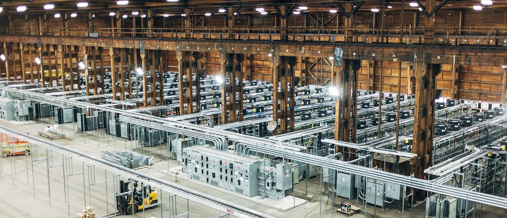

# Qui suis-je ?

* Géographe
* Ni économiste ni informaticien
* Découvert le BTC en 2013 en étudiant ce qu'est la monnaie
* Un brin geek mais surtout curieux
* [linkedIn](https://www.linkedin.com/in/thomasgoosens1985/)

# Intro à la monnaie
[Monnaie = unité de compte des échanges.](https://www.youtube.com/watch?v=qjnhF8Yw1Io)

## Brève histoire

- troc -> pièces et billets -> blockchain

## Caractéristiques d'une bonne monnaie ?

## Confiance en la monnaie
> Money is a story that everyone believes in.

| Troc      	| Pièces, billets, CB         	| Bitcoin   	|
|-----------	|-----------------------------	|-----------	|
| commodité 	| état + système banquaire    	| protocol 	|

- Le troc : pas pratique
- système banquaire : sauver ses propre miches au détriment des citoyens.
- bitcoin : un protocol informatique infalsifiable

# Le bitcoin (BTC)

## En 2 mots
> VIRES IN NUMERIS

- monnaie numérique
- open-source
- décentralisée
- publique
- Ce n'est pas une app ou une société mais un protocol
- Pas réguler par les états/banques mais par les __algorithmes__

## Histoire
- protocol inventé en 2009
- par un japonais - Satoshi Nakamoto ? [Mystère](https://www.coindesk.com/information/who-is-satoshi-nakamoto/) !
- publication ([white paper](https://bitcoin.fr/bitcoin-explique-par-son-inventeur/)) 2 mois après la chute de Lehman Brothers

## Quelques chiffres
Histoire de vous montrer la portée actuelle du BTC et sa fulgurante ascension !

### Market capitalization

- apple = 800 B et BNP 103 B

### Market price

### Trade-volume

### Nombre de transactions/jours

## Concrètement, comment ça marche ?

### Technologie blockchain
> un très grand cahier, que tout le monde peut lire librement et gratuitement, sur lequel tout le monde peut écrire, mais qui est impossible à effacer et indestructible.
Jean-Paul Delahaye.

- [Le fonctionnement de BTC repose sur la technologie __blockchain__](https://www.youtube.com/watch?v=YQduQf1058I?t=1m1s)
- Grand registre public ([voir blockexplorer](https://blockexplorer.com/)) infalsifiable de toutes les transactions passées.
- La blockchain est consultée pour chaque nouvelle transaction afin d'éviter le problème de la __double dépense__ et tentative de créer des faux BTC

### D'où viennent les BTC ?

- Emis en tant que récompense au MINAGE.
- _MINAGE_ = fait d'allouer de la puissance de calcul informatique pour valider les transactions enregistrée dans le registre distribué.
- régle d'émission précise fixée dans le code open-source du protocol (>< inflation)

### BTC : sous le capot ?

- [Clé privée/publique](https://www.youtube.com/watch?v=r4HQ8Bp-pfw)

### Système distribué

- centralized = système banquaire classique garant de la comptabilité = système banquaire
- système distribué : éviter le problème de la __Double dépense__ : technologie blockchain

### les acteurs du réseau BTC

- utilisateurs : vous, moi, et bientôt tout le monde ?
- mineurs
- marchants : en ligne, le boulanger, opérateurs téléphoniques
- places d'échanges (exchanges : kraken, poloniex, Bittrex, etc)

## Le BTC dans la vie de tous les jours

### Moyen de payement

### Moyen d'épargne

- MAX 21 000 000 de BTC !
- [Définiton pouvoir d'achat](http://www.investopedia.com/terms/p/purchasingpower.asp)
- [publication d'AXA](https://www.axabank.be/fr/blog/inflation-reduit-votre-epargne) : l'argent perd sa valeur et les fruits de votre travail sont spoliés !

### Outil de spéculation

- Extrême volatilité (whales)

### Moyen d'émancipation

- [Vous êtes votre propre banque](https://www.youtube.com/watch?v=lkNyS6z_uD8&list=PLT87O8mKz3D2DwREQwaARl-T-aomkFeGK&index=5) ==> transferts sans intermédiaires

## Considérations politiques et éthiques

### Gourmand en énergie (mining)

- [A Single Bitcoin Transaction Takes Thousands of Times More Energy Than a Credit Card Swipe](https://motherboard.vice.com/en_us/article/ypkp3y/bitcoin-is-still-unsustainable)
- [Bitcoin is unsustainable](https://motherboard.vice.com/en_us/article/ae3p7e/bitcoin-is-unsustainable)
- [Solution space as proof](https://www.coindesk.com/space-time-how-bittorrents-creator-is-attacking-bitcoins-waste-problem/)

### Anonymat

- certain degré d'anonymat (les adresses des comptes ne sont pas liées à une adresse ou identité réelle, [quoique](https://99bitcoins.com/know-more-top-seven-ways-your-identity-can-be-linked-to-your-bitcoin-address/))
- activité criminelle : affaire silkroad + [blanchiement](http://datanews.levif.be/ict/actualite/neuf-perquisitions-a-bruxelles-dans-un-dossier-de-blanchiment-via-des-bitcoins/article-normal-700169.html)

### Jamais vaincu mais ... !

- MtGox scandale - banque de BTC en ligne hackée !
- Ban au Venezuela
- [Comment pourrait-il mourir ?](https://www.vice.com/en_us/article/7beymd/this-is-how-bitcoin-could-die)

## Utiliser des bitcoins

### S'en procurer

### BTC ATM

- https://coinatmradar.com/

### Plateformes d'échanges :
- [localcoins](https://localbitcoins.com/) -> P2P
- [coinbase](https://www.coinbase.com/) -> ID
- [bitstamp](https://www.bitstamp.net/) -> ID
- [changelly](https://changelly.co) -> + anonyme

### Travailler online

[ex: plateformes freelancing](https://www.upwork.com/o/jobs/browse/skill/bitcoin/)

### Les dépenser

### Wallet/portefeuille

- simple app : desktop/smartphone/online
- Cloud (ex: [coinbase](https://www.coinbase.com/)) : vous ne possédez pas vraiment vos BTC !
- Offline (ex : [mycelium](https://wallet.mycelium.com/)) : vous êtes entièrement responsable (backups)

### Un bout de papier - paper wallet

- [Comment faire](https://www.youtube.com/watch?v=VTsHeiBhPIM)

## Anecdotes

- [légende urbaine - vieux disque dur](http://www.lemonde.fr/europe/article/2013/11/30/il-jette-son-disque-dur-il-perd-4-8-millions-d-euros_3523177_3214.html)
- [bitcoin pizza à 10 000 BTC en 2010](http://mashable.com/2017/05/23/bitcoin-pizza-day-20-million/)

## Conclusions et perspectives sur le BTC

|            | Voiture          | Bitcoin                |
|------------|------------------|------------------------|
| utiliser   | rouler           | faire des transactions |
| sécurité   | ceinture         | passwords manager, etc |
| comprendre | mécanique moteur | cryptographie          |
| confiance  | code la route    | blockchain             |

- monnaie open-source décentralisée ==> consensus entre les utilisateurs ([fork vers BTC Cash et bientôt BTC Gold ?](https://www.coindesk.com/first-cash-now-gold-another-bitcoin-hard-fork-way/))
- BTC = la panacée ? Non ! [Des crypto-monnaies vraiment équitables](http://magazine.ouishare.net/2013/05/bitcoin-human-based-digital-currency/)
- beaucoup de nouveaux concepts technico-geek

# Les autres cryptomonnaies ou "altcoins"
BTC a tokenisé la banque. Pourrait-on tokeniser d'autres secteurs ?

## Révolution numérique

- (+) gains de productivité
- (+) efficience dans l'utilisation des ressources
- (+) de sécurité

__Problème__ :
(-) Monopolistic companies that take extraordinary fees and have full control of the market (Google, Uber, Amazon, AirBnB, Deliveroo, etc)

## Révolution Blockchain

- La blockchain promet d'instaurer de la [confiance](https://blogrecherche.wp.imt.fr/2017/07/13/blockchain-technologie-confiance/) entre utilisateurs qui ne se connaissent pas sans devoir disposer d'un intermédiaire.
- [Pour comprendre la notion de confiance qu'introduit la blockchain](https://www.youtube.com/watch?v=JID9c-MABis&t=2s)
- A "[Disruptive](http://cirb.brussels/fr/blog/2016/09/blockchain-massacre)" Technology avec des concepts très techniques (DAO, DAPPS, Smart-contracts, ICO, etc)

## L'émergence des "altcoins"

- Des milliers d'applications avec leur propre token! Listées sur [coinmarketcap](https://coinmarketcap.com/all/views/all/)
- Du "simple" BTC amélioré (ex: [monero](https://getmonero.org/) pour l'anonymat) aux [DAO](https://www.coindesk.com/the-dao-just-raised-50-million-but-what-is-it/) et [Dapps](https://blog.bitnation.co/what-are-dapps/)
- Après l'uberisation, la tokenisation !

## Vers une économie distribué

## Dans tous les secteurs
- [online gambling](https://medium.com/@dao.casino/why-dao-casino-is-ethereum-for-gambling-7ed2f5cea40c),
- [ONG 2.0](https://medium.com/daoact/act-blockchain-startup-is-creating-ngo-2-0-330dbff4ccdd),
- [fonds d'investissements dans les Energies Renouvelables](https://medium.com/@solar.dao/why-solar-dao-uses-blockchain-d448d0259d8b),
- Recherche Scientifique,
- [Alimentation Durable](https://www.foodcoin.io/),
- [Predictions markets](https://medium.com/@ConsenSys/why-how-decentralized-prediction-markets-will-change-just-about-everything-15ff02c98f7c),
- etc...

## Quelques cas concrets

### Slockit
- clefs automatiques
- https://slock.it/
- article sur leur [blog](https://blog.slock.it/slock-it-decentralizing-the-emerging-sharing-economy-cf19ce09b957)

### Storj.io
- tokenization de dropbox/google drive
- https://storj.io/
- article sur [medium](https://medium.com/@DJohnstonEC/informational-report-on-storj-io-1a03c5c65266)

### Steemit
- tokenization de twitter/facebook
- https://steemit.com
- article sur [coindesk](https://www.coindesk.com/steemit-blockchain-social-media-how-works/)

### La'Zooz
- tokenization d'Uber
- http://lazooz.org/
- article sur [shareable](https://www.shareable.net/blog/lazooz-the-decentralized-crypto-alternative-to-uber)

### Silent Notary
- tokenization des notaires
- https://silentnotary.com/

## Encore d'autres exemples ?

[video 19 industries The blockchain will disrupt](https://www.youtube.com/watch?v=G3psxs3gyf8)

## Blockchain = Nouvelle révolution économique

- [Blockchain = the new google](https://techcrunch.com/2016/05/11/the-blockchain-is-the-new-google/)
- On en est au tout début ! Technologie en développement très rapide

## Proposition de définition d'un altcoin/[token](https://icomentor.net/2017/08/06/comprendre-les-tokens-definition-explication/)

- Cryptomonnaie reposant sur des protocols similaires à BTC mais avec leurs propres spécificités répondants à des besoins bien précis
- Token __protocol__ (ex: ETH) vs. token __app__ (ex: STORJ)
- usages des tokens =
  - droit d'usage d'un service
  - droit de vote
  - moyen de payement
  - réputation
  - unité de valeur d'échange au sein d'une app
- moyen de financement participatif (ICO - initial coin offering)
- mis en circulation suivant des règles pensées pour un fonctionnement optimal du protocol/ de l'app qu'ils supportent
- altcoin très populaire : l'Ethereum (ETH) (type protocol)

## Quelques mots sur l'ETH

> Ethereum is an open-source, public, blockchain-based distributed computing platform featuring __smart contract__ (scripting) functionality. It provides a decentralized Turing-complete virtual machine, the Ethereum Virtual Machine (EVM), which can execute scripts using an international network of public nodes.

- super-ordinateur mondial décentralisé et programmable dans lequel résident des [Dapps](https://blog.bitnation.co/what-are-dapps)
- [autre explication](https://www.coindesk.com/information/what-is-ethereum/)
- 90% des altcoins type token app sont créés via la blockchain ETH

## le mécanisme des ICO

- [mécanisme de levée de fonds pour future dapps](https://www.coindesk.com/200-million-60-minutes-filecoin-ico-rockets-record-amid-tech-issues/)
- émission de tokens pré-commandables contre BTC/ETH/€/$
- moyen d'investissement
- ex : [projet Filecoin : 200 Mions $ en 1h !!](https://www.coindesk.com/200-million-60-minutes-filecoin-ico-rockets-record-amid-tech-issues/)
- non régulées (beaucoup d'arnaques !)

# Investir dans les cryptomonnaies ?

- Difficile de prédire lesquels arriveront véritablement à s'imposer, à être adoptées
- nouveaux business modèles
- phase expérimentale
- très haut potentiel de ROI (bulle spéculative en cours ?)
- Acheter crypto existante ou investir dans ICO (calendrier sur [tokenmarket](https://tokenmarket.net/ico-calendar))
- S'informer et comprendre : lire, écrire, poser des questions

[guide du débutant](https://steemit.com/cryptomonnaie/@gillian-delvigne/comment-bien-se-lancer-dans-les-cryptomonnaies-le-guide-du-debutant)

# Références pour débutants
https://www.coindesk.com/information/

# Sites à suivre pour s'informer
- [coinmarketcap.com](https://coinmarketcap.com/currencies/bitcoin/)
- [blockchain.info](https://blockchain.info/charts)
- [bitcoin.fr](https://bitcoin.fr/bitcoin-explique-par-son-inventeur/)
- [lejournalducoin.com](https://journalducoin.com)
- [coindesk.com](https://www.coindesk.com/)
- [cointelegraph.com](https://cointelegraph.com)
- [cryptopotato.com](https://cryptopotato.com/)
- [mon aggrégateur](https://blog.pokyah.com/category/geeker/blockchain)
